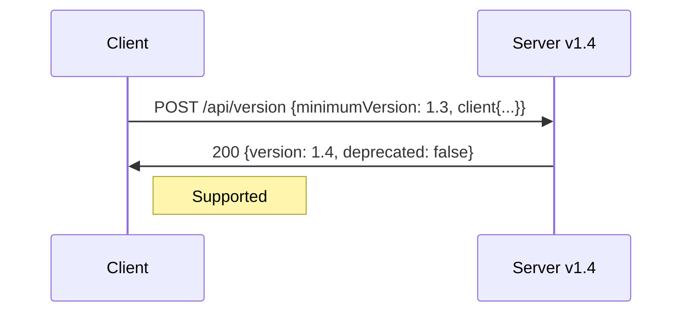
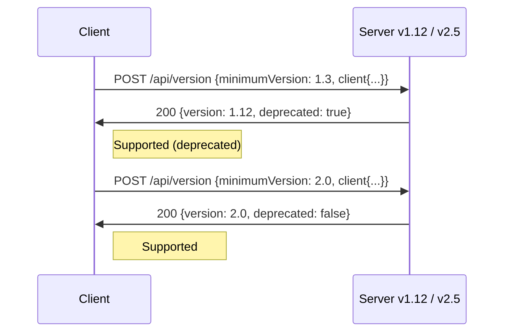
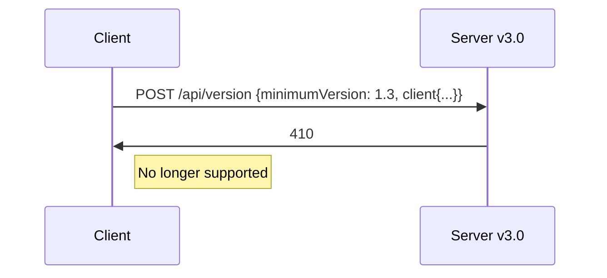
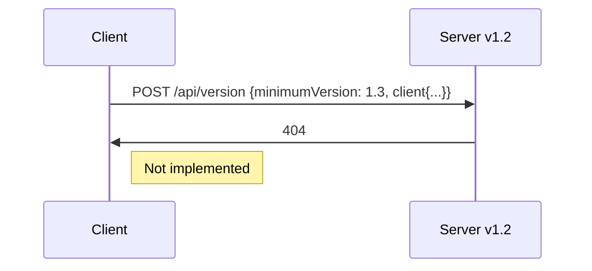

# Version negotiation

Version negotiation is the process by which a client of the i2 Analyze REST API determines whether the server it is talking to can provide the version of the API that it requires.

The server does not currently enforce the use of version negotiation, but you should use it in any client that you intend to deploy to production.
If you don't know what version the server supports, then you have no guarantee that the requests you make will work.
The endpoints that you try to use might not behave the way you expect, or they might not exist at all!

## Why negotiate version?

Imagine that you write a client against a hypothetical version `0.5` of the API.
You make use of the `/api/v0/foosearch` endpoint, which was added to the server at version `0.5`, and provide some other functionality based on some other endpoints that were all added in version `0.4`.

You test the client locally and everything works perfectly.
You send it to Customer A and it works well for them too.
But Customer B reports that whenever they try to use the "foosearch", they get errors - even though everything else works.
And then Customer C reports that nothing works, as does Customer D.

It turns out that Customer A has a server that supports version `0.5` of the API, while B's server supports `0.4`, and C's supports `0.3`.
Customer D has a much newer server that supports version `2.0` and above.

In this scenario, version negotiation would provide a much better experience.
Your client could determine that Customer C's server is too old and that Customer D's server is too new.
For Customer B, you could say that their server is also too old, or you could enable all the functionality except for "foosearch".

Conditionally enabling functionality based on the server's API version can allow your client to support older and newer servers without producing errors.
From the server's perspective, seeing requests for old versions of the API might indicate that clients are outdated and need to be upgraded.

## How does version negotiation work?

In the i2 Analyze REST API, version negotiation takes place through the version endpoint.
The client specifies the version of the API that it needs, and the server responds with a version that it supports.
For example, a request from a client that requires version `1.1` of the API might look like this:

```
POST /api/version
```

```json
{
  "minimumVersion": "1.1",
  "client": {
    "name": "My Client",
    "version": "0.0.1-demo"
  }
}
```

**Note:** The `client` object is required for logging purposes on the server, but there is no restriction on the format of the `name` and `version` fields as long as they are present.

If the server supports version `1.1`, or a later minor version of the v1 API, it responds with a `200` status code and a body that looks like this:

```json
{
  "version": "1.x",
  "deprecated": false
}
```

Here, `x` is the server's current minor version of the v1 API. `version` can be the same as the client's `minimumVersion` (`"1.1"`), or it can be higher (`"1.3"`), but it is never lower.

The `deprecated` flag is `true` if the entire major version of the API in the response is deprecated on the server.

If the server only supports versions lower than the client's `minimumVersion` - for example, `1.0` - then the response has a `404` status code.

If the requested version is no longer supported by the server, because the server is from a much newer release, then the response has a `410` status code.

**Important:** The version endpoint deals with one _major_ API version at a time (`1.0`, `1.1`, and `1.99` are all _minor_ versions of the v1 API). If you want to write a client that can use either the v1 or the v2 API, you must make distinct requests for each of those major versions. You must also generate separate client code packages, as there will be incompatibilities in the generated model and API classes between major versions.

See the [i2 Analyze API Reference](https://docs.i2group.com/analyze/public-rest-api.html#post-/api/version) for detailed API documentation, and the [walkthrough](version-negotiation.md) for a worked example of version negotiation.

### Which version do you need?

The easiest approach to version negotiation is to set the `minimumVersion` to match the API specification that you generated your code from. Any server that provides a `200` response to your request is guaranteed to be compatible with your client.

However, if your client uses only a subset of the API, it might be compatible with servers that support earlier minor versions.

The API documentation includes the version at which functionality was added. You can use that information to determine the minimum version you actually require, which might be different from taking the easy approach.

You can also use the [changelog](api-reference.md#api-version-information) to find an appropriate version of the API specification for particular i2 Analyze product releases.

## API compatibility examples

The following diagrams and descriptions explain how version negotiation proceeds in a number of typical situations.

### Client and server use same minor version


When the server implements the exact version that the client requires, the server provides a `200` response code, and the `version` in the response exactly matches the `minimumVersion` in the request.

### Server newer than client (same major version)



When the server implements a later revision of the requested major version, the server provides a `200` response code, but the `version` in the response does not match the `minimumVersion` in the request.
The client then knows exactly which version of the API the server implements, and can take advantage of that if it needs to.

If a client provides progressive enhancement on features provided by a major API version, it can make a single request for the lowest version it needs to work (hence `minimumVersion`), and then use the server's response to determine exactly which features are available.

### Server newer than client (deprecated major version)



A server can implement multiple major versions of the API, the oldest of which might be [deprecated](api-support-policy.md).
You might use the `deprecated` flag in the response to provide information to users that a client upgrade is required.
The server logs requests for deprecated versions, so that administrators can monitor the situation centrally.

### Server newer than client (major version no longer supported)



When a major version of the API has been deprecated for a sufficient period of time, it might be [removed](api-support-policy.md) in a later release.
A client request for the removed version receives a `410` response code to indicate that the client must be upgraded.
As with deprecated versions, the server logs requests for unsupported versions to aid administrators.

### Server older than client



If the latest version of the API supported by the server is lower than the `minimumVersion` requested by the client, the server returns a `404` status code, indicating that the server needs to be upgraded (or the client needs to be downgraded) for the two to work together.
Again, the server logs requests for unsupported versions.
